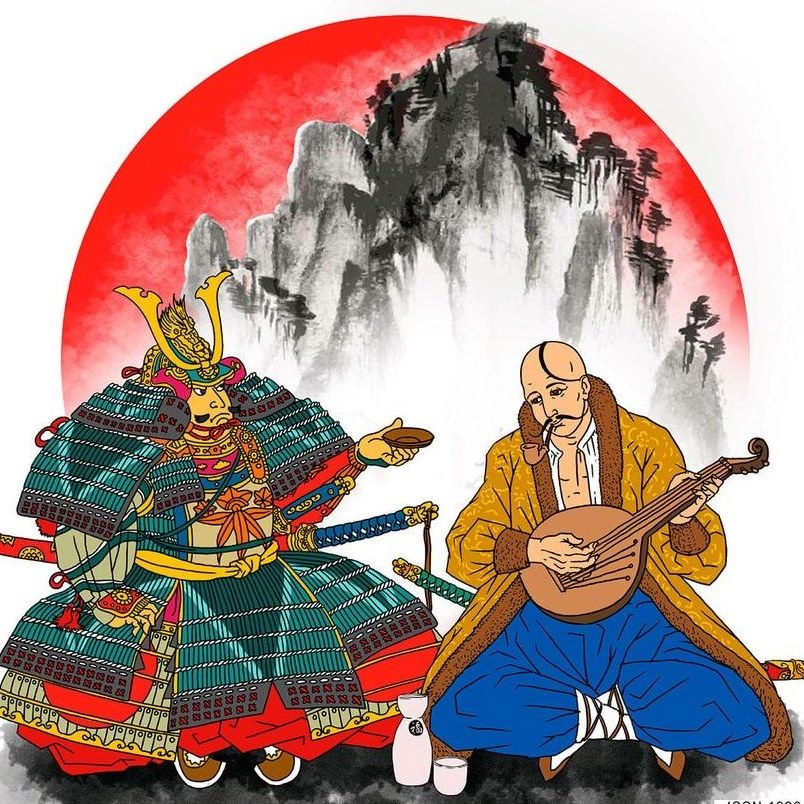
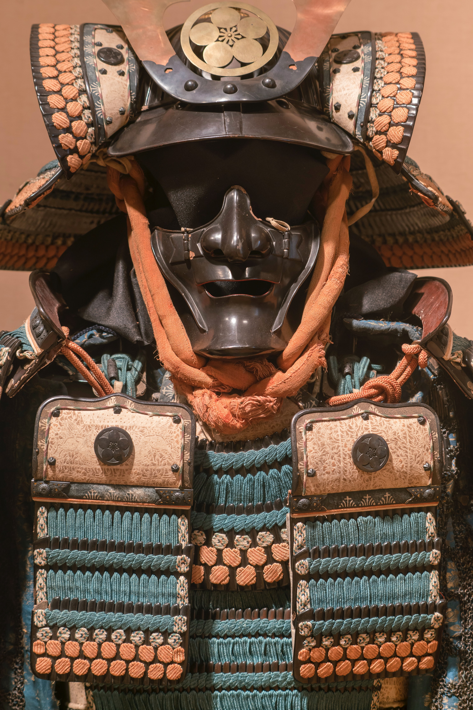
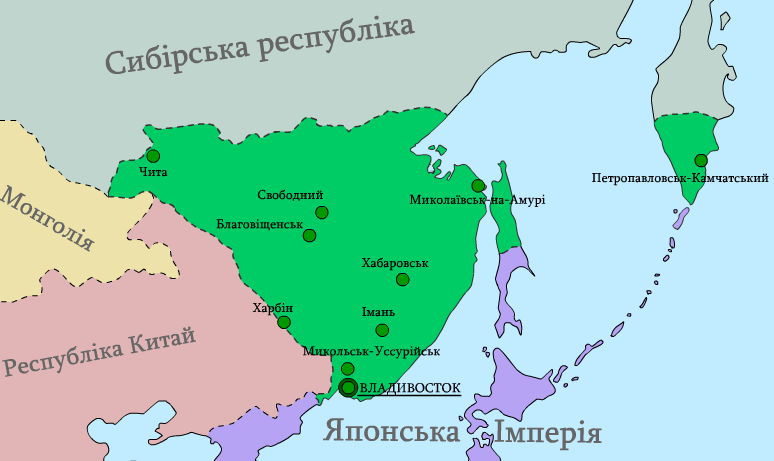
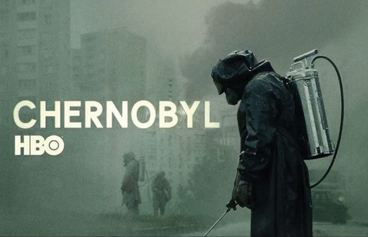
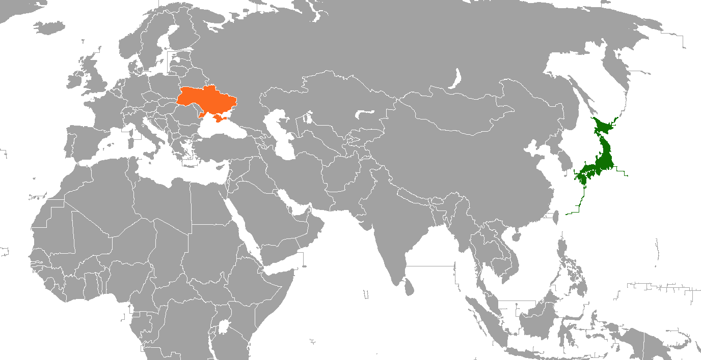

```{r setup, include=FALSE}
library(knitr)
library(summarytools)
library(here)
library(ymlthis)
library(tidyverse)
library(fontawesome)
library(readr)
library(ggthemes)
library(ggpubr)
library(RColorBrewer)
library(kableExtra)
library(data.table)
library(metathis)
library(xaringanthemer)
library(xaringanExtra)
library(data.table)
library(RefManageR)
library(plm)
library(mgcv)
library(mgcViz)
library(stargazer)
library(plotly)
library(htmlwidgets)
library(modelsummary)
library(leaflet)
library(webshot)

options(htmltools.dir.version = FALSE)
knitr::opts_chunk$set(collapse = TRUE,
                      eval = TRUE,
                      fig.retina = 3)

```


```{r xaringan-extra, echo=FALSE}

xaringanExtra::use_scribble()
xaringanExtra::use_tile_view()
xaringanExtra::use_tachyons()
xaringanExtra::use_panelset()
xaringanExtra::use_share_again()
xaringanExtra::use_broadcast()
xaringanExtra::use_search(show_icon = TRUE)

xaringanExtra::style_share_again(
  foreground = "white",
  background = "black",
  share_buttons = c("twitter", "linkedin", "facebook")
)

xaringanExtra::use_logo(
  width = "220px",
  height = "256px",
  position = xaringanExtra::css_position(top = "2em", right = "2em"),
  image_url = "assets/img/KUT.jpg",
  exclude_class = c("hide_logo", "title-slide")
)

xaringanExtra::use_extra_styles(
  hover_code_line = TRUE,         #<<
  mute_unhighlighted_code = TRUE  #<<
)

xaringanExtra::use_progress_bar(
  color = "#0051BA", 
  location = "top", 
  height = "10px"
  )
```


```{r xaringan-themer, include=FALSE, warning=FALSE}
style_duo(primary_color = "#ffffff", secondary_color = "#515151")
```

```{r metathis, echo=FALSE}
meta() %>%
  meta_name("github-repo" = "ko-suta/academic-new") %>% 
  meta_social(
    title = "日本とウクライナの文化的関係性",
    description = paste(
      "2022・獨協大学"
    ),
    url = "https://kovsiannikov.com/slides/dokkyo-jp/dokkyo-jp",
    image = "https://kovsiannikov.com/img/ukraine-anime-jp.png",
    image_alt = "2022・獨協大学",
    og_type = "website",
    og_author = "オヴシアン二コウ・コスチャンチン",
    twitter_card_type = "summary_large_image",
    twitter_creator = "@kovsiann"
  ) %>%
  include_meta()
```


# 日本とウクライナの類似点


```{r echo=FALSE, include=TRUE, out.width = "45%", fig.align='center', fig.cap = '<a href="https://www.facebook.com/ukr.embassy.japan/" style="color:Black;">画像ソース</a>'}

```

---


# クブザール 対 琵琶法師

.pull-left[

- 楽器:　コブザ、バンドゥーラ、リラ

- 最初の言及:　13世紀

- 歴史的なテーマ


```{r echo=FALSE, include=TRUE, out.width = "46%", fig.align='center', fig.cap = '<a href="https://upload.wikimedia.org/wikipedia/commons/thumb/5/5c/Slastion-Bandurist_Samiylo_Yasnij.jpg/480px-Slastion-Bandurist_Samiylo_Yasnij.jpg" style="color:Black;">画像ソース</a>'}
knitr::include_graphics("assets/img/kobzar.jpg")
```

]

--

.pull-right[


- 楽器:　琵琶

- 最初の言及: 13世紀 (「平家物語」)

- 乞食坊主


```{r echo=FALSE, include=TRUE, out.width = "100%", fig.align='center', fig.cap = '<a href="https://ukiyoestock.com/wp-content/uploads/7479052-49.png" style="color:Black;">画像ソース</a>'}
knitr::include_graphics("assets/img/biwa.png")
```

]

---

# コサック 対 武士

.pull-left[

- 16世紀に出現

- 自己組織化・大量軍隊

- 槍とピストルを備えた軽騎兵

```{r echo=FALSE, include=TRUE, out.width = "45%", fig.align='center', fig.cap = '<a href="https://cdnb.artstation.com/p/assets/images/images/007/778/547/large/kasia-slupecka-kozak-zaporowski-small.jpg?1509301491" style="color:Black;">画像ソース</a>'}
knitr::include_graphics("assets/img/kozak.jpg")
```

]

--

.pull-right[

- 12世紀に出現 (鎌倉時代)

- 戦士キャスト・貴族・遺伝性

- 弓を持つ重装甲騎兵

```{r echo=FALSE, include=TRUE, out.width = "47%", fig.align='center', fig.cap = '<a href="https://unsplash.com/photos/Y_e_3q4bErg" style="color:Black;">画像ソース</a>'}

```

]


---

# 大鵬幸喜


.pull-left[

```{r echo=FALSE, include=TRUE, out.width = "73%", fig.align='left', fig.cap = '<a href="https://upload.wikimedia.org/wikipedia/uk/8/86/Ivan_Boryshko.jpg" style="color:Black;">画像ソース</a>'}
knitr::include_graphics("assets/img/Ivan_Boryshko.jpg")
```
]

.pull-right[
 
- ### ウクライナ名: イヴァーン・ボリシコ
 
- ### サハリン（樺太廳）で日本人の母とウクライナ人の父の間に生まれた
 
- ### 1961年: 21歳で横綱になった
 
- ### 1960年から1971年の間に32のトーナメントチャンピオンシップを獲得した
]


---

# 極東のウクライナ

<ru-blockquote>地球儀を半周動かせば、欧州で起きている惨事が、対岸の火事でないことが分かる。ロシア、中国、北朝鮮と対峙する日本は地政学上、「極東のウクライナ」とも呼べる存在だ。
<br><br> .right[**山川 龍雄**.black[（日経ビジネス編集委員） 2022／3／10]]</ru-blockquote>

--

.pull-left[

```{r echo=FALSE, include=TRUE, out.width = "200%", fig.align='left', fig.cap = '<a href="https://uk.wikipedia.org/wiki/%D0%A4%D0%B0%D0%B9%D0%BB:%D0%97%D0%B5%D0%BB%D0%B5%D0%BD%D0%B8%D0%B9_%D0%9A%D0%BB%D0%B8%D0%BD_1918.png" style="color:Black;">画像ソース</a>'}

```

]

.pull-right[

- 「**緑ウクライナ**」アムール川から太平洋岸までのロシア極東におけるウクライナ人の植民地

- 1917年のロシア革命以降、**極東ウクライナ共和国**がウクライナ人によってロシア極東に建国されることが計画された。

- 領域は100万km<sup>2</sup>を含む広大な土地でウクライナ人の人口は1926年には**41％～47％**に達していた。総人口は1958年の時点で人口は310万人であった。

- 現在，北方領土の**~6割の人口**がウクライナ系（岡部芳彦・神戸学院大学教授）

]

---

# チェルノブイリ 対 福島第一

.pull-left[

```{r echo=FALSE, include=TRUE, out.width = "150%", fig.align='left', fig.cap = '<a href="https://millardwestcatalyst.com/wp-content/uploads/2019/09/6c532595-chernobyl-season-1-hbo-series-all-cmyk.jpg" style="color:Black;">画像ソース</a>'}

```

]


.pull-right[

- .blue[日付]: 1986年04月26日 `r fa("arrow-alt-circle-right", fill = "#cc0033")` 2011年03月11日

- .blue[原因]: 人的ミス `r fa("arrow-alt-circle-right", fill = "#cc0033")`　自然災害

- .blue[放射能]: 14,000 PBq (ベクレル) ~ 空気 `r fa("arrow-alt-circle-right", fill = "#cc0033")`  780 PBq ~ 海洋

- .blue[被災地]: 500 km `r fa("arrow-alt-circle-right", fill = "#cc0033")` 30 km

- .blue[移動人口]: 335,000 `r fa("arrow-alt-circle-right", fill = "#cc0033")` 154,000

- .blue[帰国人口]: なし `r fa("arrow-alt-circle-right", fill = "#cc0033")` 122,00

]


---

# チェルノブイリ・福島の協力

--

.pull-left[

.black[福島大学環境放射能研究所] (2013年に設立)  **`r fa("people-carry", fill = "green")`**

 - ウクライナ･オデッサ国立環境大学(OSENU)

 - ウクライナ･チェルニーヒウ国立工科大学(ChNUT)

 - ウクライナ科学アカデミー計算機計算システム研究所(IMMSP)

 - ウクライナ・国営専門公社エコセンター

 - ウクライナ国立科学アカデミー 原子力研究所（KINR）

 - ウクライナ国立生命環境科学大学(NUBiP)
 
.black[研究内容]: 放射性物質 (.blue[ストロンチウム90] and .blue[セシウム137]) + 汚染水 `r fa("arrow-alt-circle-right", fill = "#cc0033")` .black[立入禁止区域]を刷新する

]
--

.pull-right[


```{r echo=FALSE, fig.cap = '<a href="https://www.jica.go.jp/english/news/field/2020/20210310_01.html" style="color:Black;">画像のソース</a>'}
knitr::include_url("https://www.jica.go.jp/english/news/field/2020/20210310_01.html")
```


]


---

class: middle
background-color: yellow

# .center[.blue[ウクライナ] **日本**.black[の違い]]

---

# ウクライナと日本。地理的位置

```{r echo=FALSE, include=TRUE, fig.cap = '<a href="https://upload.wikimedia.org/wikipedia/commons/5/53/Japan_Ukraine_Locator.png" style="color:Black;">画像ソース</a>', out.width = "80%", fig.align='center'}


```

---


# 一般情報。ウクライナ対日本

--

.pull-left[

 ### .blue[人口]: 4400万人


 ### .blue[担当地域]: 603,628 $km^2$;
 

 ### .blue[一人当たりGDP]: &#36; 3,118;


 ### .blue[平均余命]: 71.6歳
]

--

.pull-right[

 ### 1億2,580万人;

 ### 377,975 $km^2$;

 ### &#36; 40,113;

 ### 84.4歳
]


---


# 政治体制　（ウクライナ対日本）

.pull-left[

- 1991年: ソ連の崩壊 (計画経済 `r fa("arrow-alt-circle-right", fill = "#cc0033")` 資本主義)

- 企業: 長期的契約 `r fa("arrow-alt-circle-right", fill = "#cc0033")` 短期的契約

- 社会主義 `r fa("arrow-alt-circle-right", fill = "#cc0033")` 民主主義

- ロシアによる軍事侵攻


```{r echo=FALSE, include=TRUE, out.width = "90%", fig.align='center', fig.cap = '<a href="https://www.podbean.com/media/share/pb-bjk2s-92e9e8" style="color:Black;">画像ソース</a>'}
knitr::include_graphics("assets/img/sovietunion.jpg")
```

]

--

.pull-right[

- 1945以降: 民主制　(自民党の支配)

- 終身雇用 `r fa("arrow-alt-circle-right", fill = "#cc0033")` [一部] 成果主義

- 隣国との平和的な関係　（ただし、領土紛争）


```{r echo=FALSE, include=TRUE, out.width = "84%", fig.align='center', fig.cap = '<a href="https://images.unsplash.com/photo-1542051841857-5f90071e7989?ixlib=rb-1.2.1&q=80&fm=jpg&crop=entropy&cs=tinysrgb&dl=jezael-melgoza-alY6_OpdwRQ-unsplash.jpg" style="color:Black;">画像ソース</a>'}
knitr::include_graphics("assets/img/tokyo.jpg")
```

]
---

background-color: #EE82EE

# 🇯🇵 .black[支援] .white[✈] 🇺🇦 

--

### 🛡️　ドローン・防弾チョッキ・ヘルメット・防寒服・天幕・カメラ・衛生資材・非常用糧食・双眼鏡・照明器具・医療用器材等

--

### 🌿　1億ドルの緊急人道支援 + 2014年以来ウクライナに対して18.7億ドルのODAを実施中

--

### 💰　６億ドルの財政支援を表明

--

### 🛂　希望する在留ウクライナ人の在留延長を許可

--

### 👣　ウクライナから日本への避難民の受入れの推進

--

### 🛑　🇷🇺 に対して経済制裁

---

class: middle
background-color: yellow

# .center.black[.blue[ウクライナ]: 激動の近代史]

--

# .center.black[.red[日本]: 戦後の安定した制度]

--

# .center[`r fa("arrow-alt-circle-down", fill = "#cc0033")`] 

--

# .center.black[理由: .light-blue[個人の財産権]の保護 `r fa("arrow-alt-circle-right", fill = "#cc0033")` 世界で最も古い企業]

--

# .center.black[.light-blue[しかし], 平和は永遠のことではない `r fa("arrow-alt-circle-right", fill = "#cc0033")` 予期せぬ困難に備えることの重要性]


---

class: title-slide-final, middle
background-size: 200px
background-position: 5% 1%

# ご清聴ありがとうございます！

## 質問 / 提案?

### [タイトルスライド画像ソース](https://www.facebook.com/worldflagsamurai/)

### 私の連絡先 `r fa("arrow-alt-circle-down", fill = "#cc0033")`

|                                                                                                            |                                   |
| :--------------------------------------------------------------------------------------------------------- | :-------------------------------- |
| <a href="mailto:ovsiannikov@kochi-tech.ac.jp">`r fa("paper-plane", fill = "#cc0033")`          | ovsiannikov@kochi-tech.ac.jp |
|                                                                                                |                              |
| <a href="https://kovsiannikov.com/slides/dokkyo-jp/dokkyo-jp">`r fa("link", fill = "#cc0033")` | kovsiannikov.com             |
