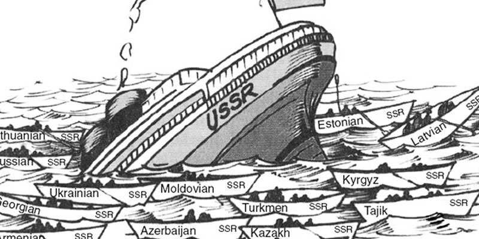

```{r setup, include=FALSE}
library(knitr)
library(summarytools)
library(here)
library(ymlthis)
library(tidyverse)
library(fontawesome)
library(readr)
library(ggthemes)
library(ggpubr)
library(RColorBrewer)
library(kableExtra)
library(data.table)
library(metathis)
library(xaringanthemer)
library(xaringanExtra)
library(data.table)
library(RefManageR)
library(plm)
library(mgcv)
library(mgcViz)
library(stargazer)
library(plotly)
library(htmlwidgets)
library(modelsummary)
library(leaflet)
library(webshot)

options(htmltools.dir.version = FALSE)
knitr::opts_chunk$set(collapse = TRUE,
                      eval = TRUE,
                      fig.retina = 3)

```


```{r xaringan-extra, echo=FALSE}

xaringanExtra::use_scribble()
xaringanExtra::use_tile_view()
xaringanExtra::use_tachyons()
xaringanExtra::use_panelset()
xaringanExtra::use_share_again()
xaringanExtra::use_broadcast()
xaringanExtra::use_search(show_icon = TRUE)

xaringanExtra::style_share_again(
  foreground = "white",
  background = "black",
  share_buttons = c("twitter", "linkedin", "facebook")
)

xaringanExtra::use_logo(
  width = "220px",
  height = "256px",
  position = xaringanExtra::css_position(top = "2em", right = "2em"),
  image_url = "assets/img/KUT.jpg",
  exclude_class = c("hide_logo", "title-slide")
)

xaringanExtra::use_extra_styles(
  hover_code_line = TRUE,         #<<
  mute_unhighlighted_code = TRUE  #<<
)

xaringanExtra::use_progress_bar(
  color = "#0051BA", 
  location = "top", 
  height = "10px"
  )
```


```{r xaringan-themer, include=FALSE, warning=FALSE}
style_duo(primary_color = "#ffffff", secondary_color = "#515151")
```

```{r metathis, echo=FALSE}
meta() %>%
  meta_name("github-repo" = "ko-suta/academic-new") %>% 
  meta_social(
    title = "日本とウクライナの文化的関係性",
    description = paste(
      "2022・高知県議会の勉強会"
    ),
    url = "https://kovsiannikov.com/slides/kut-seminar-jp/kut-seminar-jp",
    image = "https://kovsiannikov.com/img/ukraine-anime.png",
    image_alt = "2022・高知県議会の勉強会",
    og_type = "website",
    og_author = "オヴシアン二コウ　コスチャンチン",
    twitter_card_type = "summary_large_image",
    twitter_creator = "@kovsiann"
  ) %>%
  include_meta()
```


# 日本とウクライナの類似点


```{r echo=FALSE, include=TRUE, out.width = "45%", fig.align='center', fig.cap = '<a href="https://www.facebook.com/ukr.embassy.japan/" style="color:Black;">画像ソース</a>'}
knitr::include_graphics("assets/img/Kozak_Samurai.jpg")
```

---


# クブザール 対 琵琶法師

.pull-left[

- 楽器:　コブザ、バンドゥーラ、リラ

- 最初の言及:　13世紀

- 歴史的なテーマ


```{r echo=FALSE, include=TRUE, out.width = "46%", fig.align='center', fig.cap = '<a href="https://upload.wikimedia.org/wikipedia/commons/thumb/5/5c/Slastion-Bandurist_Samiylo_Yasnij.jpg/480px-Slastion-Bandurist_Samiylo_Yasnij.jpg" style="color:Black;">画像ソース</a>'}
knitr::include_graphics("assets/img/kobzar.jpg")
```

]

--

.pull-right[


- 楽器:　琵琶

- 最初の言及: 13世紀 (「平家物語」)

- 乞食坊主


```{r echo=FALSE, include=TRUE, out.width = "100%", fig.align='center', fig.cap = '<a href="https://ukiyoestock.com/wp-content/uploads/7479052-49.png" style="color:Black;">画像ソース</a>'}
knitr::include_graphics("assets/img/biwa.png")
```

]

---

# コサック 対 武士

.pull-left[

- 16世紀に出現

- 自己組織化・大量軍隊

- 槍とピストルを備えた軽騎兵

```{r echo=FALSE, include=TRUE, out.width = "45%", fig.align='center', fig.cap = '<a href="https://cdnb.artstation.com/p/assets/images/images/007/778/547/large/kasia-slupecka-kozak-zaporowski-small.jpg?1509301491" style="color:Black;">画像ソース</a>'}

```

]

--

.pull-right[

- 12世紀に出現 (鎌倉時代)

- 戦士キャスト・貴族・遺伝性

- 弓を持つ重装甲騎兵

```{r echo=FALSE, include=TRUE, out.width = "47%", fig.align='center', fig.cap = '<a href="https://unsplash.com/photos/Y_e_3q4bErg" style="color:Black;">画像ソース</a>'}
knitr::include_graphics("assets/img/samurai.jpg")
```

]


---

# 大鵬幸喜


.pull-left[

```{r echo=FALSE, include=TRUE, out.width = "73%", fig.align='left', fig.cap = '<a href="https://upload.wikimedia.org/wikipedia/uk/8/86/Ivan_Boryshko.jpg" style="color:Black;">画像ソース</a>'}
knitr::include_graphics("assets/img/Ivan_Boryshko.jpg")
```
]

.pull-right[
 
- ### ウクライナ名: イヴァーン・ボリシコ
 
- ### サハリン（樺太廳）で日本人の母とウクライナ人の父の間に生まれた
 
- ### 1961年: 21歳で横綱になった
 
- ### 1960年から1971年の間に32のトーナメントチャンピオンシップを獲得した
]


---


# チェルノブイリ 対 福島第一

.pull-left[

```{r echo=FALSE, include=TRUE, out.width = "150%", fig.align='left', fig.cap = '<a href="https://millardwestcatalyst.com/wp-content/uploads/2019/09/6c532595-chernobyl-season-1-hbo-series-all-cmyk.jpg" style="color:Black;">画像ソース</a>'}
knitr::include_graphics("assets/img/chernobyl.jpg")
```

]


.pull-right[

- .blue[日付]: 1986年04月26日 `r fa("arrow-alt-circle-right", fill = "#cc0033")` 2011年03月11日

- .blue[原因]: 人的ミス `r fa("arrow-alt-circle-right", fill = "#cc0033")`　自然災害

- .blue[放射能]: 14,000 PBq (ベクレル) ~ 空気 `r fa("arrow-alt-circle-right", fill = "#cc0033")`  780 PBq ~ 海洋

- .blue[被災地]: 500 km `r fa("arrow-alt-circle-right", fill = "#cc0033")` 30 km

- .blue[移動人口]: 335,000 `r fa("arrow-alt-circle-right", fill = "#cc0033")` 154,000

- .blue[帰国人口]: なし `r fa("arrow-alt-circle-right", fill = "#cc0033")` 122,00

]


---

# チェルノブイリ・福島の協力

--

.pull-left[

.black[福島大学環境放射能研究所] (2013年に設立)  **`r fa("people-carry", fill = "green")`**

 - ウクライナ･オデッサ国立環境大学(OSENU)

 - ウクライナ･チェルニーヒウ国立工科大学(ChNUT)

 - ウクライナ科学アカデミー計算機計算システム研究所(IMMSP)

 - ウクライナ・国営専門公社エコセンター

 - ウクライナ国立科学アカデミー 原子力研究所（KINR）

 - ウクライナ国立生命環境科学大学(NUBiP)
 
.black[研究内容]: 放射性物質 (.blue[ストロンチウム90] and .blue[セシウム137]) + 汚染水 `r fa("arrow-alt-circle-right", fill = "#cc0033")` .black[立入禁止区域]を刷新する

]
--

.pull-right[


```{r echo=FALSE, fig.cap = '<a href="https://www.jica.go.jp/english/news/field/2020/20210310_01.html" style="color:Black;">画像のソース</a>'}
knitr::include_url("https://www.jica.go.jp/english/news/field/2020/20210310_01.html")
```


]


---

class: middle
background-color: yellow

# .center[.blue[ウクライナ] **日本**.black[の違い]]

---

# ウクライナと日本。地理的位置

```{r echo=FALSE, include=TRUE, fig.cap = '<a href="https://upload.wikimedia.org/wikipedia/commons/5/53/Japan_Ukraine_Locator.png" style="color:Black;">画像ソース</a>', out.width = "80%", fig.align='center'}

knitr::include_graphics("assets/img/Japan_Ukraine_Locator.png")
```

---


# 一般情報。ウクライナ対日本

--

.pull-left[

 ### .blue[人口]: 4400万人


 ### .blue[担当地域]: 603,628 $km^2$;
 

 ### .blue[一人当たりGDP]: &#36; 3,118;


 ### .blue[平均余命]: 71.6歳
]

--

.pull-right[

 ### 1億2,580万人;

 ### 377,975 $km^2$;

 ### &#36; 40,113;

 ### 84.4歳
]


---


# 政治体制　（ウクライナ対日本）

.pull-left[

- 1991年: ソ連の崩壊 (計画経済 `r fa("arrow-alt-circle-right", fill = "#cc0033")` 資本主義)

- 企業: 長期的契約 `r fa("arrow-alt-circle-right", fill = "#cc0033")` 短期的契約

- 社会主義 `r fa("arrow-alt-circle-right", fill = "#cc0033")` 民主主義

- ロシアによる軍事侵攻


```{r echo=FALSE, include=TRUE, out.width = "90%", fig.align='center', fig.cap = '<a href="https://www.podbean.com/media/share/pb-bjk2s-92e9e8" style="color:Black;">画像ソース</a>'}

```

]

--

.pull-right[

- 1945以降: 民主制　(自民党の支配)

- 終身雇用 `r fa("arrow-alt-circle-right", fill = "#cc0033")` [一部] 成果主義

- 隣国との平和的な関係　（ただし、領土紛争）


```{r echo=FALSE, include=TRUE, out.width = "84%", fig.align='center', fig.cap = '<a href="https://images.unsplash.com/photo-1542051841857-5f90071e7989?ixlib=rb-1.2.1&q=80&fm=jpg&crop=entropy&cs=tinysrgb&dl=jezael-melgoza-alY6_OpdwRQ-unsplash.jpg" style="color:Black;">画像ソース</a>'}
knitr::include_graphics("assets/img/tokyo.jpg")
```

]
---

class: middle
background-color: yellow

# .center.black[.blue[ウクライナ]: 激動の近代史]

--

# .center.black[.red[日本]: 戦後の安定した制度]

--

# .center[`r fa("arrow-alt-circle-down", fill = "#cc0033")`] 

--

# .center.black[理由: .light-blue[個人の財産権]の保護 `r fa("arrow-alt-circle-right", fill = "#cc0033")` 世界で最も古い企業]

--

# .center.black[.light-blue[しかし], 平和は永遠のことではない `r fa("arrow-alt-circle-right", fill = "#cc0033")` 予期せぬ困難に備えることの重要性]


---

class: title-slide-final, middle
background-size: 200px
background-position: 5% 1%

# ご清聴ありがとうございます！

## 質問 / 提案?

### [タイトルスライド画像ソース](https://www.facebook.com/worldflagsamurai/)

### 私の連絡先 `r fa("arrow-alt-circle-down", fill = "#cc0033")`

|                                                                                                            |                                   |
| :--------------------------------------------------------------------------------------------------------- | :-------------------------------- |
| <a href="mailto:ovsiannikov@kochi-tech.ac.jp">`r fa("paper-plane", fill = "#cc0033")`          | ovsiannikov@kochi-tech.ac.jp |
|                                                                                                |                              |
| <a href="https://kovsiannikov.com/slides/kut-seminar/kut-seminar">`r fa("link", fill = "#cc0033")` | kovsiannikov.com             |
