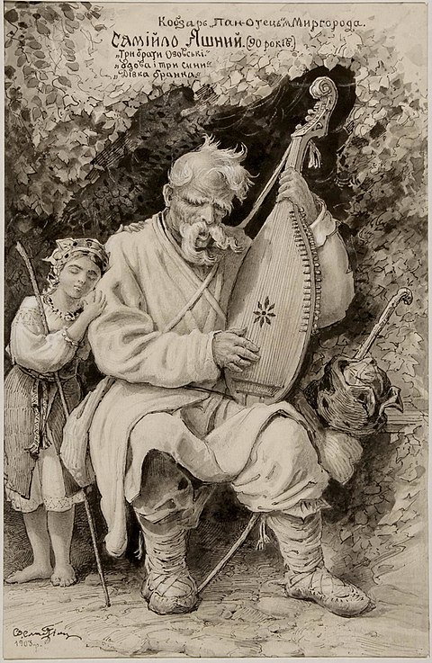
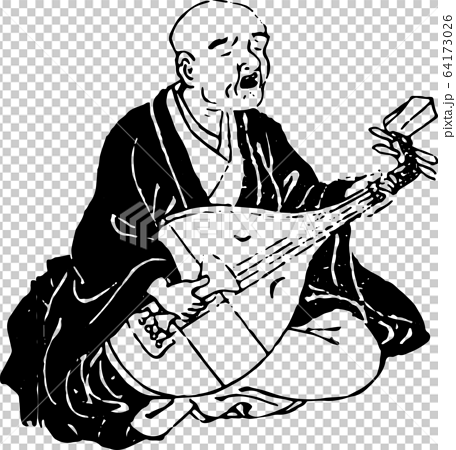
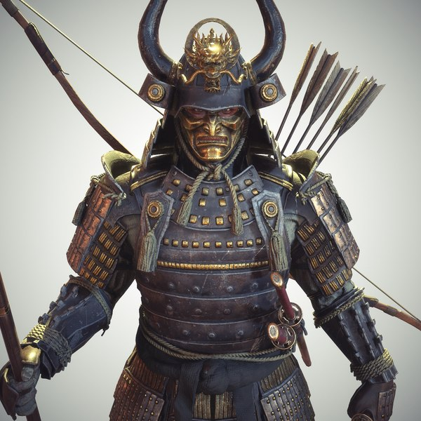
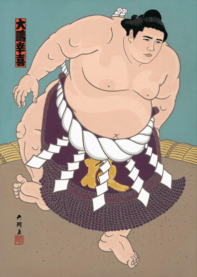
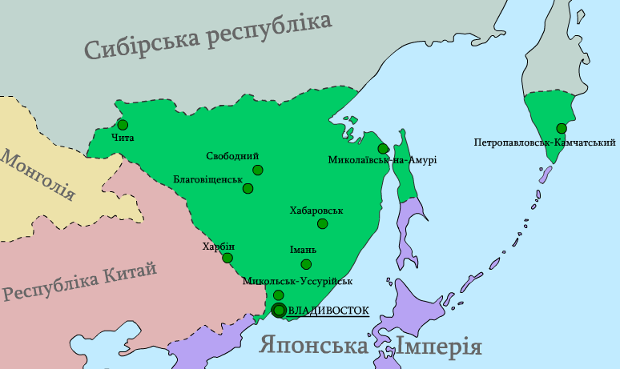
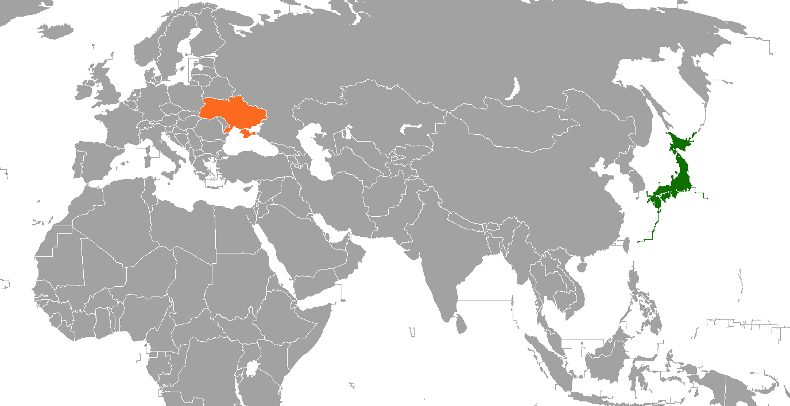
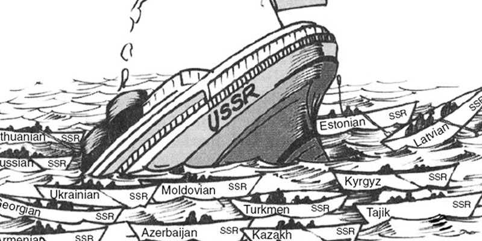

```{r setup, include=FALSE}
library(knitr)
library(summarytools)
library(here)
library(ymlthis)
library(tidyverse)
library(fontawesome)
library(readr)
library(ggthemes)
library(ggpubr)
library(RColorBrewer)
library(kableExtra)
library(data.table)
library(metathis)
library(xaringanthemer)
library(xaringanExtra)
library(data.table)
library(RefManageR)
library(plm)
library(mgcv)
library(mgcViz)
library(stargazer)
library(plotly)
library(htmlwidgets)
library(modelsummary)
library(leaflet)
library(webshot)

options(htmltools.dir.version = FALSE)
knitr::opts_chunk$set(collapse = TRUE,
                      eval = TRUE,
                      fig.retina = 3)

```


```{r xaringan-extra, echo=FALSE}

xaringanExtra::use_scribble()
xaringanExtra::use_tile_view()
xaringanExtra::use_tachyons()
xaringanExtra::use_panelset()
xaringanExtra::use_share_again()
xaringanExtra::use_broadcast()
xaringanExtra::use_search(show_icon = TRUE)

xaringanExtra::style_share_again(
  foreground = "white",
  background = "black",
  share_buttons = c("twitter", "linkedin", "facebook")
)

xaringanExtra::use_logo(
  width = "220px",
  height = "256px",
  position = xaringanExtra::css_position(top = "2em", right = "2em"),
  image_url = "assets/img/KUT.jpg",
  exclude_class = c("hide_logo", "title-slide")
)

xaringanExtra::use_extra_styles(
  hover_code_line = TRUE,         #<<
  mute_unhighlighted_code = TRUE  #<<
)

xaringanExtra::use_progress_bar(
  color = "#0051BA", 
  location = "top", 
  height = "10px"
  )
```


```{r xaringan-themer, include=FALSE, warning=FALSE}
style_duo(primary_color = "#ffffff", secondary_color = "#515151")
```

```{r metathis, echo=FALSE}
meta() %>%
  meta_name("github-repo" = "ko-suta/academic-new") %>% 
  meta_social(
    title = "Ukraine and Japan: Historical & Cultural Parallels",
    description = paste(
      "K&#333;chi Prefectural Assembly presentation"
    ),
    url = "https://kovsiannikov.com/slides/kut-seminar/kut-seminar",
    image = "https://kovsiannikov.com/img/ukraine-anime.png",
    image_alt = "K&#333;chi Prefectural Assembly presentation",
    og_type = "website",
    og_author = "Kostiantyn Ovsiannikov",
    twitter_card_type = "summary_large_image",
    twitter_creator = "@kovsiann"
  ) %>%
  include_meta()
```


# Japanese-Ukrainian parallels


```{r echo=FALSE, include=TRUE, out.width = "45%", fig.align='center', fig.cap = '<a href="https://www.facebook.com/ukr.embassy.japan/" style="color:Black;">Image source</a>'}
knitr::include_graphics("assets/img/Kozak_Samurai.jpg")
```

---


# Kobzar vs. Biwa h&#333;shi (琵琶法師)

.pull-left[

- instruments: *kobza*, *bandura*, *lira*

- first mentioning: 13th century

- historical themes


```{r echo=FALSE, include=TRUE, out.width = "46%", fig.align='center', fig.cap = '<a href="https://upload.wikimedia.org/wikipedia/commons/thumb/5/5c/Slastion-Bandurist_Samiylo_Yasnij.jpg/480px-Slastion-Bandurist_Samiylo_Yasnij.jpg" style="color:Black;">Image source</a>'}

```

]

--

.pull-right[


- instruments: *biwa*

- first mentioning: 13th century (平家物語, *Heike Monogatari*)

- Buddhist monks


```{r echo=FALSE, include=TRUE, out.width = "100%", fig.align='center', fig.cap = '<a href="https://ukiyoestock.com/wp-content/uploads/7479052-49.png" style="color:Black;">Image source</a>'}

```

]

---

# Cossacks vs. Bushi (武士)

.pull-left[

- emerged in 16th century

- self-organized; mass troops

- light cavalry with pikes and pistols

```{r echo=FALSE, include=TRUE, out.width = "45%", fig.align='center', fig.cap = '<a href="https://cdnb.artstation.com/p/assets/images/images/007/778/547/large/kasia-slupecka-kozak-zaporowski-small.jpg?1509301491" style="color:Black;">Image source</a>'}
knitr::include_graphics("assets/img/kozak.jpg")
```

]

--

.pull-right[

- emerged in 12th century (鎌倉時代)

- warrior cast; nobility; hereditary

- heavily armored cavalry with bows

```{r echo=FALSE, include=TRUE, out.width = "47%", fig.align='center', fig.cap = '<a href="https://unsplash.com/photos/Y_e_3q4bErg" style="color:Black;">Image source</a>'}

```

]


---

# Taih&#333; K&#333;ki (大鵬幸喜)


.pull-left[

```{r echo=FALSE, include=TRUE, out.width = "73%", fig.align='left', fig.cap = '<a href="https://upload.wikimedia.org/wikipedia/uk/8/86/Ivan_Boryshko.jpg" style="color:Black;">Image source</a>'}

```
]

.pull-right[
 
- ### Ukrainian name: Ivan Boryshko
 
- ### born on the Sakhalin (樺太廳, Karafuto-ch&#333;) to a Japanese mother and a Ukrainian father
 
- ### 1961: became *yokozuna* (横綱) at the age of 21
 
- ### won 32 tournament championships between 1960 and 1971
]


---

# Far Eastern Ukraine (極東のウクライナ)

<ru-blockquote>If you rotate the globe halfway through, you can see that the disaster occurring in Europe is an issue that concerns us. Japan, which confronts Russia, China, and North Korea, can be called 'Ukraine of the Far East' in terms of geopolitics.
<br><br> .right[**Tatsuo Yamakawa** .black["Nikkei Business", 2022/3/10]]</ru-blockquote>

--

.pull-left[

```{r echo=FALSE, include=TRUE, out.width = "200%", fig.align='left', fig.cap = '<a href="https://uk.wikipedia.org/wiki/%D0%A4%D0%B0%D0%B9%D0%BB:%D0%97%D0%B5%D0%BB%D0%B5%D0%BD%D0%B8%D0%B9_%D0%9A%D0%BB%D0%B8%D0%BD_1918.png" style="color:Black;">画像ソース</a>'}

```

]

.pull-right[

- **Green Ukraine**: the land in the Russian Far East area between the Amur River and the Pacific Ocean

- **Ukrainian Far East Republic** was designed as an autonomous/independent entity after the 1917 October Revolution

- 1926: over 1,000,000 km<sup>2</sup>, Ukrainians making up **41％～47％** of the entire population

- today, up to **60%** of the Northern Territories' (北方領土) population have Ukrainian roots

]


---


# Chernobyl vs. Fukushima Daiichi

.pull-left[

```{r echo=FALSE, include=TRUE, out.width = "150%", fig.align='left', fig.cap = '<a href="https://millardwestcatalyst.com/wp-content/uploads/2019/09/6c532595-chernobyl-season-1-hbo-series-all-cmyk.jpg" style="color:Black;">Image source</a>'}
knitr::include_graphics("assets/img/chernobyl.jpg")
```

]


.pull-right[

- .blue[date]: 1986/04/26 `r fa("arrow-alt-circle-right", fill = "#cc0033")` 2011/03/11

- .blue[cause]: human error `r fa("arrow-alt-circle-right", fill = "#cc0033")`   natural disaster

- .blue[radioactivity]: 14,000 PBq (Becquerel) ~ air `r fa("arrow-alt-circle-right", fill = "#cc0033")`  780 PBq ~ ocean

- .blue[area affected]: 500 km `r fa("arrow-alt-circle-right", fill = "#cc0033")` 30 km

- .blue[population relocated]: 335,000 `r fa("arrow-alt-circle-right", fill = "#cc0033")` 154,000

- .blue[population returned]: none `r fa("arrow-alt-circle-right", fill = "#cc0033")` 122,00

]


---

# Chernobyl-Fukushima cooperation

--

.pull-left[

.black[福島大学環境放射能研究所] (founded in 2013)  **`r fa("people-carry", fill = "green")`**

 - ウクライナ･オデッサ国立環境大学(OSENU)

 - ウクライナ･チェルニーヒウ国立工科大学(ChNUT)

 - ウクライナ科学アカデミー計算機計算システム研究所(IMMSP)

 - ウクライナ・国営専門公社エコセンター

 - ウクライナ国立科学アカデミー 原子力研究所（KINR）

 - ウクライナ国立生命環境科学大学(NUBiP)
 
.black[Research]: radioactive substances (.blue[strontium-90] and .blue[cesium-137]) + contaminated waters `r fa("arrow-alt-circle-right", fill = "#cc0033")` revamping the .black[Exclusion Zones]

]
--

.pull-right[


```{r echo=FALSE, fig.cap = '<a href="https://www.jica.go.jp/english/news/field/2020/20210310_01.html" style="color:Black;">Source</a>'}
knitr::include_url("https://www.jica.go.jp/english/news/field/2020/20210310_01.html")
```


]


---

class: middle
background-color: yellow

# .center[.blue[Ukraine] **Japan** .black[differences]]

---

# Ukraine & Japan: Geographic location

```{r echo=FALSE, include=TRUE, fig.cap = '<a href="https://upload.wikimedia.org/wikipedia/commons/5/53/Japan_Ukraine_Locator.png" style="color:Black;">Image source</a>', out.width = "80%", fig.align='center'}


```

---


# General Information: Ukraine vs. Japan

--

.pull-left[

 ### .blue[Population]: 44 million people;


 ### .blue[Territory]: 603,628 $km^2$;
 

 ### .blue[GDP per capita]: &#36; 3,118;


 ### .blue[Life expectancy]: 71.6 years
]

--

.pull-right[

 ### 125.8 million people;

 ### 377,975 $km^2$;

 ### &#36; 40,113;

 ### 84.4 years
]


---


# Political regimes (Ukraine vs. Japan)

.pull-left[

- 1991 Soviet Union collapse (planned economy `r fa("arrow-alt-circle-right", fill = "#cc0033")` capitalism)

- companies: long-term `r fa("arrow-alt-circle-right", fill = "#cc0033")` short-term contracts

- socialism `r fa("arrow-alt-circle-right", fill = "#cc0033")` democracy

- ongoing war with Russia


```{r echo=FALSE, include=TRUE, out.width = "90%", fig.align='center', fig.cap = '<a href="https://www.podbean.com/media/share/pb-bjk2s-92e9e8" style="color:Black;">Image source</a>'}

```

]

--

.pull-right[

- post 1945: democratic system (LDP domination)

- Sh&#363;shin koy&#333; (終身雇用) `r fa("arrow-alt-circle-right", fill = "#cc0033")` [partially] performance-based

- peaceful relationships with neighbors (however: territorial disputes)


```{r echo=FALSE, include=TRUE, out.width = "84%", fig.align='center', fig.cap = '<a href="https://images.unsplash.com/photo-1542051841857-5f90071e7989?ixlib=rb-1.2.1&q=80&fm=jpg&crop=entropy&cs=tinysrgb&dl=jezael-melgoza-alY6_OpdwRQ-unsplash.jpg" style="color:Black;">Image source</a>'}
knitr::include_graphics("assets/img/tokyo.jpg")
```

]
---

background-color: #EE82EE

# 🇯🇵 .black[support] .white[✈] 🇺🇦 

--

### 🛡️️ drones, bulletproof vests, helmets, winter battle dress uniform, tents, cameras, hygiene products, emergency rations, binoculars, flashlights, medical equipment...

--

### 🌿 emergency humanitarian assistance of 💲200 million via international organizations (Japan has provided Ukraine 💲1.87 billion in ODA since 2014)

--

### 💰 financial support of 💲600 million

--

### 🛂 visa extensions to any Ukrainians in Japan

--

### 👣 accepting evacuees (more than 2000 people already)

--

### 🛑 economic sanctions against 🇷🇺


---

class: middle
background-color: yellow

# .center.black[.blue[Ukraine]: turbulent modern history]

--

# .center.black[.red[Japan]: stable post-war institutions]

--

# .center[`r fa("arrow-alt-circle-down", fill = "#cc0033")`] 

--

# .center.black[reason: .light-blue[individual property rights'] protection `r fa("arrow-alt-circle-right", fill = "#cc0033")` oldest companies in the world]

--

# .center.black[.light-blue[but], peace is not eternal `r fa("arrow-alt-circle-right", fill = "#cc0033")` importance of being prepared for unexpected challenges]


---

class: title-slide-final, middle
background-size: 200px
background-position: 5% 1%

# Thank You for Your attention!

## Questions / Suggestions?

### [title-slide picture source](https://www.facebook.com/worldflagsamurai/)

### You can access the presentation & contact me `r fa("arrow-alt-circle-down", fill = "#cc0033")`

|                                                                                                            |                                   |
| :--------------------------------------------------------------------------------------------------------- | :-------------------------------- |
| <a href="mailto:ovsiannikov@kochi-tech.ac.jp">`r fa("paper-plane", fill = "#cc0033")`          | ovsiannikov@kochi-tech.ac.jp |
|                                                                                                |                              |
| <a href="https://kovsiannikov.com/slides/kut-seminar/kut-seminar">`r fa("link", fill = "#cc0033")` | kovsiannikov.com             |
