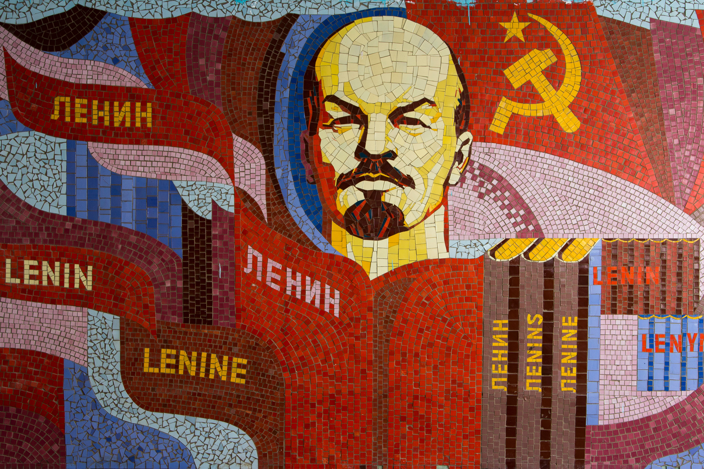

```{r setup, include=FALSE}
library(knitr)
library(summarytools)
library(here)
library(ymlthis)
library(tidyverse)
library(fontawesome)
library(readr)
library(ggthemes)
library(ggpubr)
library(RColorBrewer)
library(kableExtra)
library(data.table)
library(metathis)
library(xaringanthemer)
library(xaringanExtra)
library(data.table)
library(RefManageR)
library(plm)
library(mgcv)
library(mgcViz)
library(stargazer)
library(plotly)
library(htmlwidgets)
library(modelsummary)
library(leaflet)
library(webshot)

options(htmltools.dir.version = FALSE)
knitr::opts_chunk$set(collapse = TRUE,
                      eval = TRUE,
                      fig.retina = 3)

```


```{r xaringan-extra, echo=FALSE}

xaringanExtra::use_scribble()
xaringanExtra::use_tile_view()
xaringanExtra::use_tachyons()
xaringanExtra::use_panelset()
xaringanExtra::use_share_again()
xaringanExtra::use_broadcast()
xaringanExtra::use_search(show_icon = TRUE)

xaringanExtra::style_share_again(
  foreground = "white",
  background = "black",
  share_buttons = c("twitter", "linkedin", "facebook")
)

xaringanExtra::use_logo(
  width = "220px",
  height = "256px",
  position = xaringanExtra::css_position(top = "2em", right = "2em"),
  image_url = "assets/img/KUT.jpg",
  exclude_class = "hide_logo"
)

xaringanExtra::use_extra_styles(
  hover_code_line = TRUE,         #<<
  mute_unhighlighted_code = TRUE  #<<
)

xaringanExtra::use_progress_bar(
  color = "#0051BA", 
  location = "top", 
  height = "10px"
  )
```


```{r xaringan-themer, include=FALSE, warning=FALSE}
style_duo(primary_color = "#ffffff", secondary_color = "#515151")
```

```{r metathis, echo=FALSE}
meta() %>%
  meta_name("github-repo" = "ko-suta/academic-new") %>% 
  meta_social(
    title = "Ukraine and Japan: <br> Comparative Advantages",
    description = paste(
      "Global Competency Modelling 2021"
    ),
    url = "https://kovsiannikov.com/slides/kut-seminar/kut-seminar",
    image = "https://kovsiannikov.com/img/wheat-field.jpg",
    image_alt = "2021 KUT Global Competency Modelling",
    og_type = "website",
    og_author = "Kostiantyn Ovsiannikov",
    twitter_card_type = "summary_large_image",
    twitter_creator = "@kovsiann"
  ) %>%
  include_meta()
```


# Japanese-Ukrainian parallels


```{r echo=FALSE, include=TRUE, out.width = "50%", fig.align='center'}
knitr::include_graphics("assets/img/Kozak_Samurai.jpg")
```

---

```{r echo=FALSE, include=FALSE}
knitr::include_url("https://mariaruban.com/ukraine-in-the-mirror-of-japan")
```


# Kobzar vs. Biwa h&#333;shi (琵琶法師)

.pull-left[

- instruments: *kobza*, *bandura*, *lira*

- first mentioning: 13th century

- historical themes


```{r echo=FALSE, include=TRUE, out.width = "50%", fig.align='center'}

```

]

--

.pull-right[


- instruments: *biwa*

- first mentioning: 13th century (平家物語, *Heike Monogatari*)

- Buddhist monks


```{r echo=FALSE, include=TRUE, out.width = "90%", fig.align='center'}
knitr::include_graphics("assets/img/biwa.png")
```

]

---

# Cossacks vs. Bushi (武士)

.pull-left[

- emerged in 16th century

- self-organized; mass troops

- light cavalry with pikes and pistols

```{r echo=FALSE, include=TRUE, out.width = "55%", fig.align='center'}
knitr::include_graphics("assets/img/kozak.jpg")
```

]

--

.pull-right[

- emerged in 12th century (鎌倉時代)

- warrior cast; nobility; hereditary

- heavily armored cavalry with bows

```{r echo=FALSE, include=TRUE, out.width = "80%", fig.align='center'}
knitr::include_graphics("assets/img/samurai.jpg")
```

]


---

# Taih&#333; K&#333;ki (大鵬幸喜)


.pull-left[

```{r echo=FALSE, include=TRUE, out.width = "90%", fig.align='left'}
knitr::include_graphics("assets/img/Ivan_Boryshko.jpg")
```
]

.pull-right[
 
- ### Ukrainian name: Ivan Boryshko
 
- ### born on the Sakhalin (樺太廳, Karafuto-ch&#333;) to a Japanese mother and a Ukrainian father
 
- ### 1961: became *yokozuna* (横綱) at the age of 21
 
- ### won 32 tournament championships between 1960 and 1971
]


 

<!-- # Exports: Ukraine vs. Japan -->


```{r include=FALSE, echo=FALSE, out.width='50%', fig.show="hold"}
knitr::include_graphics("assets/img/Ukraine_Exports.png")

```


<!-- # Export destinations: Ukraine vs. Japan -->


```{r include=FALSE, echo=FALSE, out.width='50%', fig.show="hold"}


```

<!-- # Import sources: Ukraine vs. Japan -->


```{r include=FALSE, echo=FALSE, out.width='50%', fig.show="hold"}

knitr::include_graphics("assets/img/Japan_Import_Partners.jpg")
```


---

background-image: url("assets//img/chernobyl.jpg")
background-position: right
background-size: 650px


# Chernobyl vs. Fukushima Daiichi

.pull-left[

- .blue[date]: 1986/04/26 `r fa("arrow-alt-circle-right", fill = "#cc0033")` 2011/03/11

- .blue[cause]: human error `r fa("arrow-alt-circle-right", fill = "#cc0033")`   natural disaster

- .blue[radioactivity]: 14,000 PBq (Becquerel) ~ air `r fa("arrow-alt-circle-right", fill = "#cc0033")`  780 PBq ~ ocean

- .blue[area affected]: 500 km `r fa("arrow-alt-circle-right", fill = "#cc0033")` 30 km

- .blue[population relocated]: 335,000 `r fa("arrow-alt-circle-right", fill = "#cc0033")` 154,000

- .blue[population returned]: none `r fa("arrow-alt-circle-right", fill = "#cc0033")` 122,00

]


---

# Chernobyl-Fukushima cooperation

--

.pull-left[

.black[福島大学環境放射能研究所] (founded in 2013)  **`r fa("people-carry", fill = "green")`**

 - ウクライナ･オデッサ国立環境大学(OSENU)

 - ウクライナ･チェルニーヒウ国立工科大学(ChNUT)

 - ウクライナ科学アカデミー計算機計算システム研究所(IMMSP)

 - ウクライナ・国営専門公社エコセンター

 - ウクライナ国立科学アカデミー 原子力研究所（KINR）

 - ウクライナ国立生命環境科学大学(NUBiP)

]
--

.pull-right[

- ### research on radioactive substances (.blue[strontium-90] and .blue[cesium-137])

- ### research on contaminated waters `r fa("arrow-alt-circle-right", fill = "#cc0033")`

- ### revamping the Exclusion Zones

]


---

class: middle
background-color: yellow

# .center[.blue[Ukraine] **Japan** .black[differences]]

---

# Ukraine & Japan: Geographic location

```{r echo=FALSE, include=TRUE, out.width = "200%"}
knitr::include_graphics("assets/img/Japan_Ukraine_Locator.png")
```

---


# General Information: Ukraine vs. Japan

--

.pull-left[

 ### .blue[Population]: 44 million people;


 ### .blue[Territory]: 603,628 $km^2$;
 

 ### .blue[GDP per capita]: &#36; 3,118;


 ### .blue[Life expectancy]: 71.6 years
]

--

.pull-right[

 ### 125.8 million people;

 ### 377,975 $km^2$;

 ### &#36; 40,113;

 ### 84.4 years
]


---


# Political regimes (Ukraine vs. Japan)

.pull-left[

- 1991 Soviet Union collapse (planned economy `r fa("arrow-alt-circle-right", fill = "#cc0033")` capitalism)

- companies: long-term `r fa("arrow-alt-circle-right", fill = "#cc0033")` short-term contracts

- socialism `r fa("arrow-alt-circle-right", fill = "#cc0033")` democracy

- ongoing conflict with Russia


```{r echo=FALSE, include=TRUE, out.width = "90%", fig.align='center'}

```

]

--

.pull-right[

- post 1945: democratic system (LDP domination)

- Sh&#363;shin koy&#333; (終身雇用) `r fa("arrow-alt-circle-right", fill = "#cc0033")` [partially] performance-based

- peaceful relationships with neighbors (however: territorial disputes)


```{r echo=FALSE, include=TRUE, out.width = "90%", fig.align='center'}
knitr::include_graphics("assets/img/tokyo.jpg")
```

]
---

class: middle
background-color: yellow

# .center.black[.blue[Ukraine]: turbulent modern history]

--

# .center.black[.red[Japan]: stable post-war institutions]

--

# .center[`r fa("arrow-alt-circle-down", fill = "#cc0033")`] 

--

# .center.black[reason: .light-blue[indivual property rights'] protection `r fa("arrow-alt-circle-right", fill = "#cc0033")` oldest companies in the world]

--

# .center.black[.light-blue[but], peace is not eternal `r fa("arrow-alt-circle-right", fill = "#cc0033")` always be ready to face sudden changes!]


---

class: title-slide-final, middle
background-size: 200px
background-position: 5% 1%

# Thank You for Your attention!

## Questions / Suggestions?

### You can access the presentation & contact me `r fa("arrow-alt-circle-down", fill = "#cc0033")`

|                                                                                                            |                                   |
| :--------------------------------------------------------------------------------------------------------- | :-------------------------------- |
| <a href="mailto:ovsiannikov@kochi-tech.ac.jp">`r fa("paper-plane", fill = "#cc0033")`          | ovsiannikov@kochi-tech.ac.jp |
|                                                                                                |                              |
| <a href="https://kovsiannikov.com/slides/kut-seminar/kut-seminar">`r fa("link", fill = "#cc0033")` | kovsiannikov.com             |
