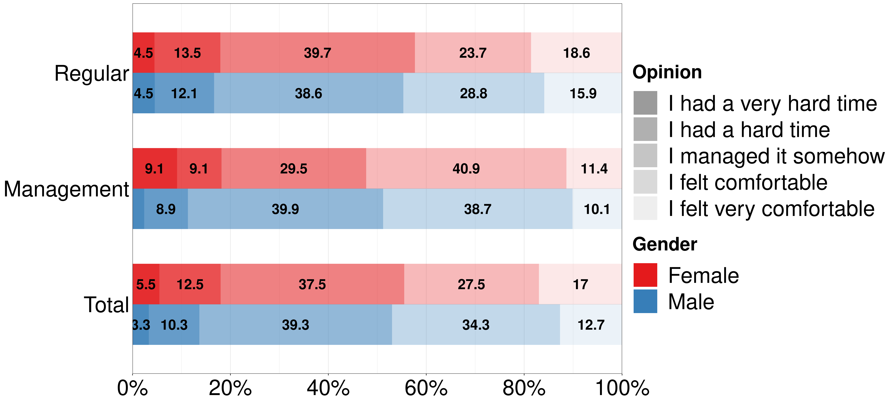
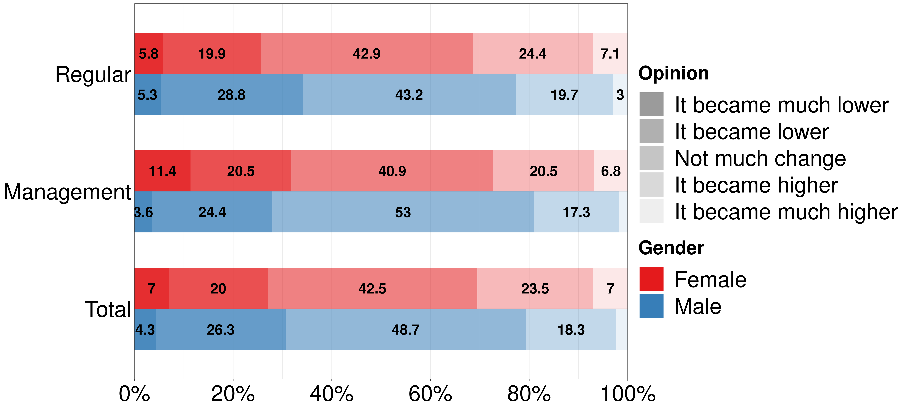
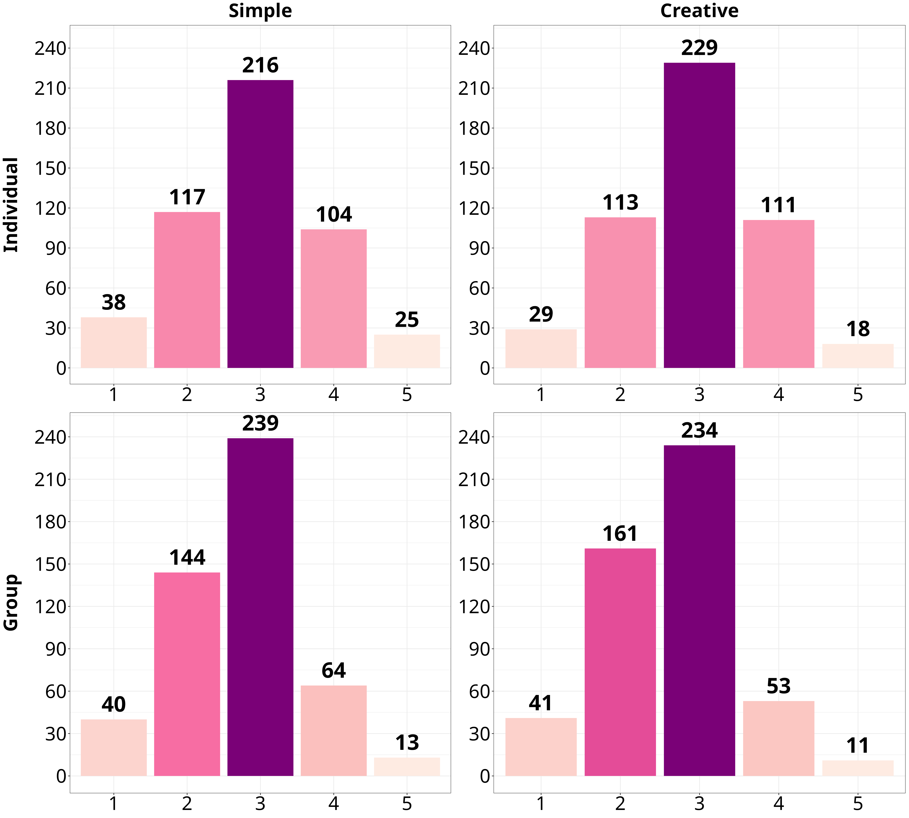
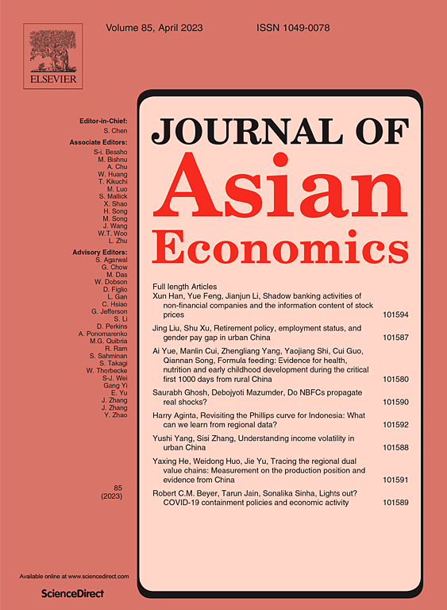
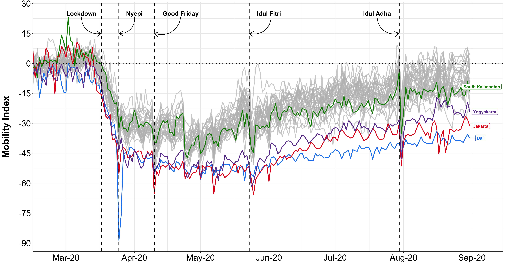

```{r setup, include=FALSE}
library(knitr)
library(showtext)
library(summarytools)
library(here)
library(ymlthis)
library(tidyverse)
library(fontawesome)
library(readr)
library(ggthemes)
library(ggpubr)
library(RColorBrewer)
library(kableExtra)
library(data.table)
library(metathis)
library(xaringanthemer)
library(xaringanExtra)
library(data.table)
library(RefManageR)
library(plm)
library(mgcv)
library(mgcViz)
library(stargazer)
library(plotly)
library(htmlwidgets)
library(modelsummary)

options(htmltools.dir.version = FALSE)
knitr::opts_chunk$set(collapse = TRUE,
                      fig.retina = 3)

```


```{r, load_refs, include=FALSE, cache=FALSE}
# BibOptions(check.entries = FALSE,
#            bib.style = "authoryear",
#            cite.style = "alphabetic",
#            style = "markdown",
#            hyperlink = FALSE,
#            dashed = FALSE)
# myBib <- ReadBib(here("static", "slides", "SASE-2021", "Innovation.bib"), check = FALSE)
```


```{r xaringan-extra, echo=FALSE}

xaringanExtra::use_scribble()
xaringanExtra::use_tile_view()
xaringanExtra::use_tachyons()
xaringanExtra::use_panelset()
xaringanExtra::use_share_again()
xaringanExtra::use_broadcast()
xaringanExtra::use_search(show_icon = TRUE)

xaringanExtra::style_share_again(
  foreground = "white",
  background = "black",
  share_buttons = c("twitter", "linkedin", "facebook")
)

xaringanExtra::use_logo(
  width = "220px",
  height = "256px",
  position = xaringanExtra::css_position(top = "2em", right = "2em"),
  image_url = "assets/img/KUT.jpg",
  exclude_class = "hide_logo"
)

xaringanExtra::use_extra_styles(
  hover_code_line = TRUE,         #<<
  mute_unhighlighted_code = TRUE  #<<
)

xaringanExtra::use_progress_bar(
  color = "#0051BA", 
  location = "top", 
  height = "10px"
  )
```


```{r xaringan-themer, include=FALSE, warning=FALSE}
style_duo(primary_color = "#ffffff", secondary_color = "#515151")
```

```{r metathis, echo=FALSE}
meta() %>%
  meta_name("github-repo" = "ko-suta/academic-new") %>% 
  meta_social(
    title = "Presentation of the ongoing research",
    description = paste(
      "Job Seminar",
      "Research Institute for Future Design"
    ),
    url = "https://kovsiannikov.com/slides/rifd/rifd",
    image = "https://kovsiannikov.com/img/Techno-screen.png",
    image_alt = "RIFD Job Seminar",
    og_type = "website",
    og_author = "Kostiantyn Ovsiannikov",
    twitter_card_type = "summary_large_image",
    twitter_creator = "@kovsiann"
  ) %>%
  include_meta()
```

# Areas of expertise

--

.pull-left-narrow[
.center[## 🧑‍🔧]]
.pull-right-wide[## labor economics]

--

.pull-left-narrow[
.center[## 🧪]]
.pull-right-wide[## experimental economics]

--

.pull-left-narrow[
.center[## 🏗]]
.pull-right-wide[## public economics]

---
class: title-slide-section-red middle

# .black[Project 1.] **.white[Telework-related productivity & satisfaction]**

--

### Ovsiannikov, K., Kotani, K., & Morita, H. (2022). Online productivity and types of assignments in a Japanese workplace. *Social Design Engineering Series*, 2022-5

---
class: highlight-last-item

# Why this research matters

- ### Growing importance of **telework**, especially due to the **COVID-19** impact 🦠

--

- ### Challenge of replicating corporate operations remotely granting the importance of **face-to-face** interactions 🤝

--

- ### Distinct corporate institutional arrangements in Japan (**relational finance** & **stakeholder governance**) 💴 🏣

--

- ### Chance to re-create optimal **work-life balance** by combining office work and telework 🌸

---

# RQ & Hypotheses

<ru-blockquote>What are the main factors affecting **productivity** and **job satisfaction** in an online environment?</ru-blockquote>

--
> **Hypothesis 1**
>
The perceived telework productivity is higher for .white.bg-black[individual] than for .white.bg-black[collective] tasks.

--

> **Hypothesis 2**
>
The perceived telework productivity is higher for .white.bg-black[simple] than for .white.bg-black[creative] tasks.

--

> **Hypothesis 3**
>
Managers and recipients of .white.bg-black[“seniority-merit”] wages are less productive in an online environment than, respectively, ordinary employees and recipients of .white.bg-black[“performance-based”] wages.

---

# Data & Findings

.panelset.sideways[
.panel[.panel-name[**Sample features**]

- ### 500 employees (sourced via the marketing company)

- ### 41 out of 47 Japanese **prefectures** 🗾

- ### 300 **males** 👷‍♂ & 200 **females** 👷‍♀

- ### 50% employed in **SMEs** (< 1000 workers) 💼; 50% — in **large companies** 👨‍💼
]


.panel[.panel-name[**Telework-related comfort**]

```{r echo=FALSE, include=TRUE, out.width = "100%", fig.align='center'}

```

]

.panel[.panel-name[**Telework productivity**]


```{r echo=FALSE, include=TRUE, out.width = "100%", fig.align='center'}

```

]

.panel[.panel-name[**Individual vs. collective & Simple vs. creative**]


```{r echo=FALSE, include=TRUE, out.width = "65%", fig.align='center', fig.cap = '“1” — lowest score, “5” — highest score'}

```

]

.panel[.panel-name[**Key takeaways**]

- ### online productivity is significantly lower for **collective** than for **individual** assignments (based on paired Wilcoxon T-test)

- ### employees under the **"seniority-merit"** wage system experience consistently lower levels of online productivity than recipients of **"performance-based"** wages for all types of assignments

- ### **managerial affiliation** ➡ **low group productivity**; high COVID-period **sleeping hours** ➡ **high individual productivity** for both simple and creative tasks

]

.panel[.panel-name[**Next steps**]

- ### encapsulating intra-corporate features (**↕** and **↔** **communication**) based on the sample of 1000 respondents

- ### designing **experiments** to reproduce different types of assignments in a face-to-face vs. online working environment

]

]

---

class: title-slide-section-grey middle

# .black.bg-white[Project 2.] **.white[Perils associated with non-regular employment]**

--

.pull-right-wide[
.center[### Putra, R., Ovsiannikov, K., & Kotani, K. (2023). COVID-19-associated income loss and job loss: Evidence from Indonesia. *Journal of Asian Economics*]]
.pull-left-narrow[

```{r echo=FALSE, include=TRUE, out.width = "80%", fig.align='center'}

```

]

---
class: highlight-last-item

# Why this research matters

- ### Non-regular employees have **weaker social protection** and are easy targets for corporate layoffs during crises 🎲

--

- ### **Shareholders' pressure** ➡ prioritizing short-term profits at the expense of employment security 💹

--

- ### **Lower productivity** of precarious labor ➡ negative impact on corporate sustainability 🥀

---
# RQ & Hypothesis

<ru-blockquote>What are the main features of **income-** and **job-loss** deprivations accruing within developing economies due to the impact of the the **COVID-19** pandemic?</ru-blockquote>

--
> **Hypothesis**
>
Against the impact of COVID-19, informally employed workers such as .white.bg-black[self-employed] and .white.bg-black[temporary workers] suffer higher magnitudes of income loss and job loss than formally employed workers.

---
# Data & Findings

.panelset.sideways[
.panel[.panel-name[**Sample features**]

- ### 292,000 observations (2020 National Labor Force Survey)

- ### 511 out of 514 Indonesian **sub-provinces** 🇮🇩

- ### 52% employed **formally** 🦺, 48% — **informally** 🎨

- ### 49% **urban** 🌃, 51% **rural** residents 🚜

- ### COVID-19 **infection rate proxy** used for Propensity Score Matching (PSM): `r fa("facebook", fill = "blue")` Data for Good (FDG) measuring daily mobility in .white.bg-black[August 2020] vs. .white.bg-black[February 2020] 🚶
]


.panel[.panel-name[**Indonesia’s regional trends**]

```{r echo=FALSE, include=TRUE, out.width = "100%", fig.align='center', fig.cap = ' Google Community Mobility Report'}

```

]

.panel[.panel-name[**Findings**]

- #### **self-employed** are 25% more likely than regular workers to experience **income loss**

- #### **temporary employees** are 15% more likely than regular workers to experience **income loss** and 1% more likely — **job loss**

- #### **urban** residents are 1% more likely than rural to experience **income loss**

- #### **household heads** have 2% higher chances of **losing income** and 0.4% higher chances of **losing job** than respondents with other family roles

- #### respondents with **higher education** are 20% less likely to **loose income** and 1% less likely to **loose job** than those with **incomplete high-school** education

]

]

---

# Contribution to the RIFD mission

.panelset[

.panel[.panel-name[Adherence to Future Design (FD) principles 🌱]

- ### Corporate Social Responsibility (**CSR**) & Socially Responsible Investment (**SRI**) 

- ### corporate mission and raison d'être

- ### conceptualizing an ideal workplace: online ➕ face-to-face

]

.panel[.panel-name[Technical know-how 🛠️]

.pull-left-narrow[
.center[## `r fa("r-project", fill = "blue")` `r fa("plus-square", fill = "black")` `r fa("markdown", fill = "black")`]]
.pull-right-wide[## manuscripts `r fa("code", fill = "black")` presentations `r fa("code", fill = "black")` websites]

.pull-left-narrow[
.center[## `r fa("python", fill = "green")`]]
.pull-right-wide[## .white.bg-black[oTree] `r fa("code-merge", fill = "black")` online experiments]

]

.panel[.panel-name[International collaborations 🌏]

.pull-right[


```{r echo=FALSE}
knitr::include_url("http://ffj.ehess.fr/kostiantyn_ovsiannikov.html")
```


]

]

]
---

# Conclusions

--

> 
**1.** Institutional features associated with .white.bg-black[R&D spending] provide valuable signals for investors across multiple industries.
>

???

* Most of the companies, but especially the ones belonging to **Pharm** and **Chemical** industries are still embedded in a system of industrial coordination. Oligopolistic features still prevalent

--

> 
**2.** Quality of a patented output .white.bg-black[(Citations per Patent)] mostly matters for the manufacturing sector.
>

???

* Thereby these companies react to the accumulating competitive pressures and are redefining themselves within an open-market system

--

> 
**3.** Pronounced nonlinear trend in the market perception of .white.bg-black[corporate age]: only the more experienced companies receive market premium as they get older.
>


---

class: title-slide-final, middle
background-image: url(assets/img/SASE.png)
background-size: 200px
background-position: 5% 1%

# Thank You for Your attention!

## Questions / Suggestions?

### You can access the presentation & contact me `r fa("arrow-alt-circle-down", fill = "#cc0033")`

|                                                                                                            |                                   |
| :--------------------------------------------------------------------------------------------------------- | :-------------------------------- |
| <a href="mailto:ovsiannikov@kochi-tech.ac.jp">`r fa("paper-plane", fill = "#cc0033")`          | me@kovsiannikov.com |
|                                                                                                |                              |
| <a href="https://kovsiannikov.com/slides/rifd/rifd">`r fa("link", fill = "#cc0033")` | kovsiannikov.com             |
